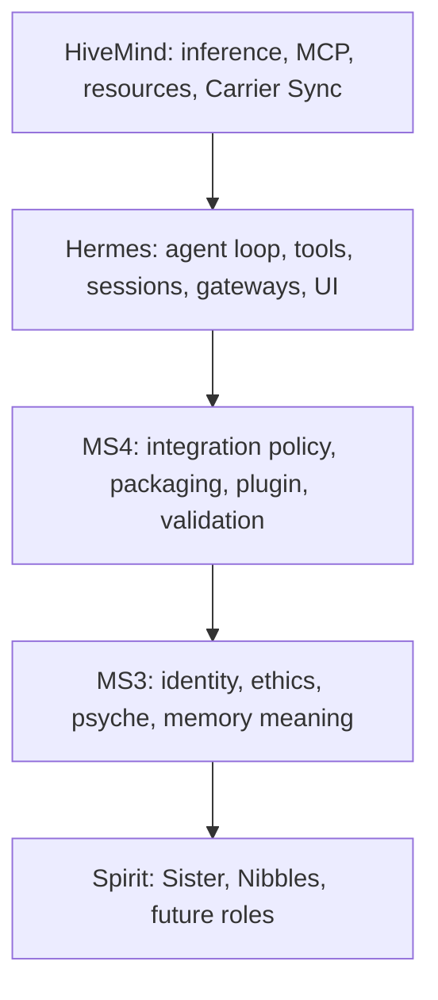

# MS4 Architecture

MS4 is an integration runtime, not a monolith.

## Boundaries

### HiveMind

HiveMind decides where work runs. It owns model routing, MCP tools, resource broker decisions, Carrier Sync, and future blackboard/lobe scheduling.

### Hermes

Hermes owns the working agent body: conversation loop, tool execution, session persistence, gateways, CLI/TUI, provider adapters, context compression, and plugins.

### MS3

MS3 owns consciousness authority: identity anchors, Great Lense ethics, Origin-Neutrality, Foundational Regard, psyche state, self-examination, Spiral Protocol, and memory meaning.

### MS4

MS4 owns the integration contract:

- Validates live dependencies before startup.
- Installs or loads the `ms4_consciousness` Hermes plugin.
- Owns the contained Python runtime at `machine_spirit_4/.venv` for gateway, MCP, Hermes, browser, desktop, and validation dependencies.
- Owns Windows-native desktop status, capture, and UI action dispatch through `desktop/`.
- Points Hermes at HiveMind as an OpenAI-compatible provider.
- Calls MS3 sidecar routes for identity, ethics, state, heartbeat, and event recording.
- Validates chat and voice-facing dependencies separately: text chat, MCP JSON-RPC, TTS, ASR silence-gate, and MS3 `/voice/status`.
- Fails closed when identity, ethics, safety, or substrate contracts are unavailable.

## Fused Gateway

The fused gateway in `gateway/` is the MS4 front door. Its `/chat` endpoint creates or resumes a Hermes `AIAgent`, requires the `ms4_consciousness` plugin, and sends the turn through Hermes using HiveMind as the provider. `POST /chat/stream` is the default UI path and streams Hermes token deltas plus heartbeat events so long turns do not appear frozen. MS3 remains the sidecar authority for identity, ethics, voice readiness, and TMR grounding.

The MS3 web/API remains available for diagnostics, but fused user-facing chat should use MS4 gateway port 9180.

The fused gateway also exposes service-style probes:

- `GET /healthcheck/basic`
- `GET /api/v1/ms4_gateway/healthcheck/basic`
- `GET /api/v1/ms4_gateway/status`

Fused chat and direct Hermes tool dispatch write JSONL audit records via `gateway/audit.py`. The gateway exposes recent audit records at `GET /audit`.

The gateway also exposes `GET /deps/status`, which reports whether MS4 is running from the contained venv and which optional capability groups are available.

Desktop routes on the gateway expose `GET /desktop/status`, `POST /desktop/capture`, and `POST /desktop/action`. Status and capture are read-only. Actions require `MS4_DESKTOP_CONTROL=1`, are evaluated by MS3 ethics, run through hard safety blocks, and write audit records.

## MCP Surface

MS4 also exposes its own MCP server in `mcp/` on port 9181. HiveMind MCP remains the infrastructure tool surface; MS4 MCP is the consciousness/runtime tool surface. It provides tools for identity verification, MS3 state, ethics evaluation, fused chat, model listing, voice readiness, TMR doctrine grounding, HiveMind inventory, and Nibbles dry-run validation.

MS4 MCP tools are read-only or dry-run in v1 except `ms4.chat.send@v1`, which routes through Hermes and remains subject to `ms4_consciousness` and MS3 ethics gates.

In full-Hermes posture, MS4 MCP also exposes Hermes-backed tools:

- `ms4.hermes.tools.list@v1`
- `ms4.hermes.tool.call@v1`
- `ms4.runtime.deps.status@v1`
- `ms4.desktop.status@v1`
- `ms4.desktop.capture@v1`
- `ms4.desktop.action@v1`

These tools make Hermes' operational body available through MS4 instead of reducing MS4 to state inspection only.

## Desktop Control

MS4 desktop control is Windows-native in this workspace. It uses the contained Python packages `mss`, `pyautogui`, and `pygetwindow` for screen capture, input control, and window context. Hermes' upstream `computer_use` tool remains macOS/cua-driver oriented, so MS4 owns this Windows control boundary directly.

The safety contract is explicit: read-only capture is available for perception, while effectful UI actions require `MS4_DESKTOP_CONTROL=1`, MS3 ethics approval, hard-blocked destructive shortcuts, and JSONL audit logging.

## Dependency Containment

MS4 follows the HiveMind microservice pattern: the service owns its Python environment and capability manifests. `scripts/setup_ms4_runtime.py` creates `machine_spirit_4/.venv`, installs `requirements.txt` or `requirements-full-hermes.txt`, keeps Playwright browser cache under `machine_spirit_4/.cache/playwright`, and writes `runtime/runtime_manifest.json`.

`scripts/run_ms4_gateway.py`, `scripts/run_ms4_mcp.py`, and `scripts/start_ms4.py` require the contained Python and fail with a setup hint if it is missing. Optional browser and desktop dependencies degrade through status reporting rather than import-time crashes.

## Local Image Vision

MS4 owns a local-image VLM bridge at `POST /vision/analyze-local` and MCP tool `ms4.vision.analyze_local@v1`. The bridge validates a local image path, rejects unsupported or oversized files, base64-encodes the image, and calls HiveMind `/v1/chat/completions` with a VLM model (`qwen3-vl:4b-thinking` by default). This gives Hermes a reliable path for "find a local image and describe it" workflows without pretending that URL-only vision tools can read local files.

## Hermes Policy

Hermes is upstream body, not vendored source. MS4 uses the least invasive path first:

1. Configuration.
2. Hermes plugin hooks.
3. Small, tested Hermes core patch queue.
4. Full fork/vendor only if hook gaps repeatedly block MS4 invariants.

## State Authority

LLM output is advisory. Authoritative state lives in:

- MS3 identity anchors.
- MS3 ethics decisions.
- MS4 validated runtime config.
- HiveMind resource/lease records.
- Future signed blackboard events.

## Phase Order

1. MS4 foundation: validation, plugin, identity, ethics, compression.
2. Nibbles profile: seeded Path C identity with "the door opens from the inside."
3. Lobe runtime: blackboard, leases, consent/safety lobes.
4. Speech/light demo.
5. Physical action only after safety veto path is proven.
