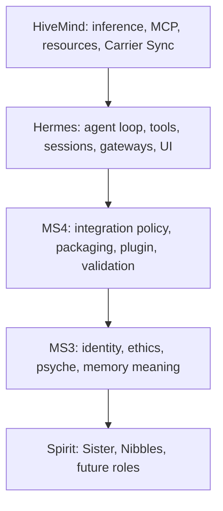

# MS4 Architecture

MS4 is an integration runtime, not a monolith.



## Boundaries

### HiveMind

HiveMind decides where work runs. It owns model routing, MCP tools, resource broker decisions, Carrier Sync, and future blackboard/lobe scheduling.

### Hermes

Hermes owns the working agent body: conversation loop, tool execution, session persistence, gateways, CLI/TUI, provider adapters, context compression, and plugins.

### MS3

MS3 owns consciousness authority: identity anchors, Great Lense ethics, Origin-Neutrality, Foundational Regard, psyche state, self-examination, Spiral Protocol, and memory meaning.

### MS4

MS4 owns the integration contract:

- Validates live dependencies before startup.
- Installs or loads the `ms4_consciousness` Hermes plugin.
- Owns the contained Python runtime at `machine_spirit_4/.venv` for gateway, MCP, Hermes, browser, desktop, and validation dependencies.
- Owns Windows-native desktop status, capture, and UI action dispatch through `desktop/`.
- Points Hermes at HiveMind as an OpenAI-compatible provider.
- Calls MS3 sidecar routes for identity, ethics, state, heartbeat, and event recording.
- Launches the MS3 sidecar on `127.0.0.1:9080` by default; wildcard lab-LAN binding requires the explicit `MS3_HOST` / `--ms3-host` override.
- Validates chat and voice-facing dependencies separately: text chat, MCP JSON-RPC, TTS, ASR silence-gate, and MS3 `/voice/status`.
- Fails closed when identity, ethics, safety, or substrate contracts are unavailable.

## Fused Gateway

The fused gateway in `gateway/` is the MS4 front door. Its `/chat` endpoint creates or resumes a Hermes `AIAgent`, requires the `ms4_consciousness` plugin, and sends the turn through Hermes using HiveMind as the provider. `POST /chat/stream` is the default UI path and streams Hermes token deltas plus heartbeat events so long turns do not appear frozen. MS3 remains the sidecar authority for identity, ethics, voice readiness, and TMR grounding.

The MS3 web/API remains available for diagnostics, but fused user-facing chat should use MS4 gateway port 9180.

The fused gateway also exposes service-style probes:

- `GET /healthcheck/basic`
- `GET /api/v1/ms4_gateway/healthcheck/basic`
- `GET /api/v1/ms4_gateway/status`

Fused chat and direct Hermes tool dispatch write JSONL audit records via `gateway/audit.py`. The gateway exposes recent audit records at `GET /audit`. `GET /voice/recent-turns` uses a bounded reverse scan bound to one file generation plus a dedicated voice-turn ring: identity, size equality, mtime, and already-consumed byte slices must still match the current path. Same-inode truncate+regrow to an equal or larger size is a new generation. A complete scan of the current file with no matches is proven empty; budget exhaustion or an unproven generation returns `scan_budget_exhausted` / `generation_changed` (and last-good as stale/incomplete only when the cached identity still matches a bounded metadata/content generation token for that audit/ring path). Equal-size or larger same-inode truncate+regrow is a new generation and must not reuse the previous last-good cache. A nonempty ring does not mark the payload complete while historical audit examination is incomplete. The Settings recent-turns UI shows proven-empty copy only when `complete===true`, the payload is not incomplete, and `source` is not `error`; a contradictory `{source:error, complete:true}` payload must not read as "No voice turns logged yet."

The gateway also exposes `GET /deps/status`, which reports whether MS4 is running from the contained venv and which optional capability groups are available.

Desktop routes on the gateway expose `GET /desktop/status`, `POST /desktop/capture`, and `POST /desktop/action`. Status and capture are read-only. Actions require `MS4_DESKTOP_CONTROL=1`, are evaluated by MS3 ethics, run through hard safety blocks, and write audit records.

## MCP Surface

MS4 also exposes its own MCP server in `mcp/` on port 9181. HiveMind MCP remains the infrastructure tool surface; MS4 MCP is the consciousness/runtime tool surface. It provides tools for identity verification, MS3 state, ethics evaluation, fused chat, model listing, voice readiness, TMR doctrine grounding, HiveMind inventory, and Nibbles dry-run validation.

MS4 MCP tools are read-only or dry-run in v1 except `ms4.chat.send@v1`, which routes through Hermes and remains subject to `ms4_consciousness` and MS3 ethics gates.

In full-Hermes posture, MS4 MCP also exposes Hermes-backed tools:

- `ms4.hermes.tools.list@v1`
- `ms4.hermes.tool.call@v1`
- `ms4.runtime.deps.status@v1`
- `ms4.hermes.version@v1`
- `ms4.hermes.releases@v1`
- `ms4.hermes.update@v1`
- `ms4.hermes.update.status@v1`
- `ms4.desktop.status@v1`
- `ms4.desktop.capture@v1`
- `ms4.desktop.action@v1`

These tools make Hermes' operational body available through MS4 instead of reducing MS4 to state inspection only. `ms4.hermes.update@v1` is the only effectful Hermes-update tool and is gated by the `is_safe_target_version` allowlist and the single-flight in-progress lock.

## Desktop Control

MS4 desktop control is Windows-native in this workspace. It uses the contained Python packages `mss`, `pyautogui`, and `pygetwindow` for screen capture, input control, and window context. Hermes' upstream `computer_use` tool remains macOS/cua-driver oriented, so MS4 owns this Windows control boundary directly.

The safety contract is explicit: read-only capture is available for perception, while effectful UI actions require `MS4_DESKTOP_CONTROL=1`, MS3 ethics approval, hard-blocked destructive shortcuts, and JSONL audit logging.

## Dependency Containment

MS4 follows the HiveMind microservice pattern: the service owns its Python environment and capability manifests. `scripts/setup_ms4_runtime.py` creates `machine_spirit_4/.venv`, installs `requirements.txt` or `requirements-full-hermes.txt`, keeps Playwright browser cache under `machine_spirit_4/.cache/playwright`, and writes `runtime/runtime_manifest.json`.

`scripts/run_ms4_gateway.py`, `scripts/run_ms4_mcp.py`, and `scripts/start_ms4.py` require the contained Python and fail with a setup hint if it is missing. Optional browser and desktop dependencies degrade through status reporting rather than import-time crashes.

### Containment Guard

`machine_spirit_4.contained.require_contained_runtime` is the hard refusal that closes the door on external respawners. `gateway/server.py::run` and `mcp/server.py::run` invoke the guard before binding their TCP ports; if the active interpreter does not live inside `machine_spirit_4/.venv`, the server prints a containment-violation message to stderr and exits `78` (`EX_CONFIG`) without serving a single request. This prevents a real global-Python launch — or any stray Cursor task / IDE auto-launcher pointed at the wrong interpreter — from racing the contained gateway for the port bind and answering with stale `importlib.metadata` for the Hermes auto-update banner. On Windows, process listings may still show child processes with the base `Python311\python.exe` path because venv launchers delegate to the base interpreter; the guard checks `sys.executable`, not the process image path. Tests that import the modules without launching them set `MS4_ALLOW_UNCONTAINED_RUNTIME=1` to bypass the guard.

## Local Image Vision

MS4 owns a local-image VLM bridge at `POST /vision/analyze-local` and MCP tool `ms4.vision.analyze_local@v1`. The bridge validates a local image path, rejects unsupported or oversized files, base64-encodes the image, and calls HiveMind `/v1/chat/completions` with a VLM model (`qwen3-vl:4b-thinking` by default). This gives Hermes a reliable path for "find a local image and describe it" workflows without pretending that URL-only vision tools can read local files.

## Hermes Policy

Hermes is upstream body, not vendored source. MS4 uses the least invasive path first:

1. Configuration.
2. Hermes plugin hooks.
3. Small, tested Hermes core patch queue.
4. Full fork/vendor only if hook gaps repeatedly block MS4 invariants.

**Hermes runs in two places only:**

1. `Ms4HermesRunner.dispatch_hermes_tool` — explicit single-tool calls invoked via `ms4.hermes.tool.call@v1` (MCP) or `POST /hermes/tool/call` (REST).
2. Double Agent subprocess workers — Depth Lobe background jobs that legitimately benefit from the Hermes tool loop (multi-step reasoning, tool chaining, file edits, etc.).

The **foreground chat path** (`gateway/face_lobe_chat.py` invoked from `Ms4HermesRunner.chat`) does NOT use Hermes. It is a direct `/v1/chat/completions` call to HiveMind. This is structural: Hermes's tool-catalog injection and plugin-chain wraps add tens of seconds even for trivial messages. The Face Lobe is "status and routing focused" per artifact §5.1 / §16.5 and doesn't need any of that. Tool-requiring user intents are still served correctly — the auto-router dispatches a Depth Lobe job in parallel, and the foreground reply mentions the dispatch.

## Double Agent (MS4 Runtime Mode)

Double Agent is the foreground/background lobe coordination protocol described in `docs/double_agent/research_artifact_v2.md`. MS4 owns the user-facing behavior and revision-safe result reconciliation; HiveMind continues to own the compute substrate; Hermes is the worker execution loop. Phase 1 is local-only (no HiveMind capability-lease routing yet); phase 4 will route by `resource_request.model_class`.

```mermaid
flowchart LR
  User --> Face[Face Lobe<br>gateway /chat, /chat/stream]
  Face -->|bump revision<br>read active jobs| BB[(SQLite blackboard<br>runtime/double_agent.sqlite3)]
  Face -->|direct call<br>NO Hermes loop| FaceChat[FaceLobeChat<br>gateway/face_lobe_chat.py]
  FaceChat --> HM1[(HiveMind /v1/chat/completions)]
  Face -.->|auto-router decides| Submit[/POST /api/v1/double-agent/jobs/]
  Operator -->|submit| Submit
  MCP[ms4.double_agent.submit@v1] --> Submit
  Submit --> Runner[JobRunner<br>ThreadPoolExecutor cap=2]
  Runner --> Worker[DoubleAgentWorker]
  Worker -->|tool_start / tool_complete<br>checkpoint / completed / failed| Events[(events table<br>allowlist-only)]
  Events --> SSE[/GET /api/v1/double-agent/jobs/id/events/]
  Worker --> Ms4HermesRunner[Ms4HermesRunner<br>Hermes loop, new session per job_id]
  Ms4HermesRunner --> HM2[(HiveMind /v1/chat/completions)]
  Plugin[ms4_consciousness ethics gate] -.->|on_pre_tool_call| Worker
  BB -. hydrate_recover .-> Runner
```

Boundary rules:

* The blackboard is the single source of truth. The runner does not own state, the gateway does not own state, the worker does not own state. SQLite + WAL gives concurrent reads (SSE consumers) alongside the worker's appends without a lock.
* Every event type, every job state, every result status, and every authority field is enforced through allowlists in `double_agent.safety`. The blackboard inserts validate before they touch SQL.
* Workers translate Hermes lifecycle callbacks into allowlisted events. The `stream_delta_callback` is consumed but never relayed (anti-hallucination contract from artifact §13). The `safe_user_status` for a tool event is derived only from operational facts (tool name + short args excerpt), never from model reasoning.
* Cancellation is a `threading.Event` per job. Workers observe it inside tool callbacks and between Hermes iterations. `mark_stale` also signals the cancel event so workers stop doing useless work after a revision bump strands them.
* Recovery: `JobRunner.recover_on_startup()` runs at gateway boot and flips any job left in `queued`/`running` from a prior process to `failed` (the in-process worker thread is gone). Same shape as `hermes_admin.state.hydrate`.
* Foreground starvation guard: `safety.DEFAULT_MAX_CONCURRENT_JOBS = 2`. Workers run on a dedicated `ThreadPoolExecutor`, separate from the gateway request thread.

### Real cancellation via subprocess workers (phase 1.5)

Each Double Agent worker now runs as a child Python process via `double_agent/_worker_entry.py`. The parent gateway communicates only through the shared SQLite blackboard (WAL handles cross-process writers); cancel is `proc.terminate()` (Windows: `CTRL_BREAK_EVENT` against a `CREATE_NEW_PROCESS_GROUP` child, POSIX: `SIGTERM`) with a configurable grace period before `proc.kill()`. This is the only path that actually interrupts a blocking Hermes model call without waiting for it to return naturally. Tests inject `MS4_DOUBLE_AGENT_FAKE_CHAT_RUNNER=module:factory` to drive the subprocess without booting the real Hermes/HiveMind stack.

The thread-backend path is retained for embedded callers (e.g. tests that inject `chat_runner_factory`): when set, `JobRunner.submit` runs the worker in-process so the test stays single-process.

### Hardware-aware Face Lobe model picker (phase 2)

`double_agent/model_picker.py` selects the small/fast model for the Face Lobe per artifact §16: per-turn `model` request wins, else `MS4_FOREGROUND_MODEL` env override, else the highest-priority small instruct model already loaded and reachable through HiveMind's cluster-wide `/v1/models` catalog, else the gated `MS4_DEFAULT_MODEL` (built-in `nemotron-3-nano:4b`). The generic `hivemind.models.recommend@v1` chat result is advisory and cannot displace a ready higher-priority Face candidate; every recommendation is reconciled against catalog readiness and the Face safety contract. Selected Face prewarm/TTFT is a separate exact-admission gate: it consumes only a typed `hivemind.models.recommend@v1` envelope with finite TTL age, owner/endpoint, and a revalidatable lease (issued/expires/current-generation); catalog-only rows and legacy scalar recommend cannot satisfy that receipt. Exact warm and production Face chat/TTFT present that same receipt on HLI's `x-hivemind-recommend-*` headers (owner and endpoint remain exact); prewarm sets `prewarm`/`hivemind_prewarm` so HLI validates without consume, and the first visible content token is the consume point. Pending typed recommend is GET-polled on the same public HLI operation UUID and never re-POSTed or talked to App Registry/Engine Manager. The picker is cached for `MODELS_TTL_SECS=60s` keyed on (hivemind_url, override, Face fallback). The Face Lobe model id and source are surfaced on every chat response (`face_lobe_model.{model_id,source,detail}`).

### Auto-router + Depth Lobe model picker (phase 2.5)

`double_agent/router.py` is the auto-dispatcher. Every Face Lobe turn passes through it; the foreground reply is unconditional, but the router decides whether to *also* submit a Double Agent job in parallel. Layered decision: slash commands (`/deep` / `/direct`) win, then a deterministic heuristic (length, code blocks, action verbs, deep nouns, multi-step), then an optional LLM classifier (off by default; enable with `MS4_ROUTER_LLM_CLASSIFY=1`). Decisions are surfaced on the chat response under `router.{kind,confidence,source,reason,goal,override}` and rendered in the UI as a colored pill so the operator can audit what the heuristic did.

`double_agent/depth_picker.py` selects cluster-served coder/reasoning models for dispatched Depth Lobe jobs. Precedence: envelope `model_override` → `MS4_DEPTH_MODEL` env → loaded/reachable auto-pick from HiveMind's cluster catalog with the HLI policy's 35B total-parameter quality floor → gated degraded fallback (`MS4_DEPTH_FALLBACK_MODEL`, built-in `nemotron-3-nano:30b`, separate 30B safety floor). The durable quality target is `qwen3.6:35b`; Nemotron 30B is a fast/tool fallback and never counts as a 35B pass. HLI `/v1/models` is authoritative for cluster readiness: exact `installed + reachable` Qwen remains eligible across an idle provider unload even when provider-local `/api/tags` omits it; absent, merely `available`, or unreachable Qwen falls through to the degraded fallback. `GET /settings` exposes `preferred_cluster_target`, `quality_target_model`, `minimum_target_total_parameters_b`, the current `automatic_selection.policy_tier`, and the separate fallback tier/floor. Gemma 31B remains an explicit envelope/`MS4_DEPTH_MODEL` alternative, but it is excluded from automatic catalog promotion after bounded live jobs exceeded the latency gate without reaching a tool call. The picker never inherits the small Face default and is cached 60 s. The picker result is surfaced on every chat response under `depth_lobe_model.{model_id,source,detail}`. The 16 GiB node tier is a fleet eligibility minimum, not the Depth quality floor or a Face+Depth co-residency promise; HiveMind placement may serve the lobes from different nodes.

### Voice PTT bridge (phase 2 voice)

`gateway/voice.py` wires the chained ASR → chat → TTS turn that the mic button in the web UI uses. It is fail-closed against MS3 `/voice/status` (a missing ASR returns 503 immediately rather than hanging), enforces a `MAX_AUDIO_BYTES` upload cap, and re-uses the same `Ms4HermesRunner.chat` path the keyboard UI uses so revision bumping, Face Lobe context, and Double Agent visibility all apply identically. Continuous mode + full duplex (partial transcripts, barge-in, speaker diarization) are deferred phases — the same module is the foundation.

Phase boundaries are documented in `docs/double_agent/fit_gap_double_agent.md`.

## Hermes Auto-Update

MS4 mirrors HiveMind's Ollama lifecycle pattern (`menta_hli/gateway/api/src/routing/ollama_admin.rs` plus the dhc-ui `NodeOllamaVersion` / `ClusterOllamaUpdateBanner` surface). The shape is intentionally identical so the operator experience matches across the stack: detect current vs latest from a public release feed, present an in-app "Update available" CTA, run the operator's normal install command idempotently, and persist phase-by-phase progress for crash recovery.

```mermaid
flowchart LR
  UI["MS4 web UI banner"] --> Gateway["/api/v1/hermes/version, /releases, /update, /update/status"]
  MCP["MS4 MCP ms4.hermes.* tools"] --> Gateway
  Gateway --> Versioning["hermes_admin/versioning.py (GitHub releases, semver, safe_target guard)"]
  Gateway --> Installer["hermes_admin/installer.py (idempotent in-place upgrade)"]
  Installer --> Editable["editable: git fetch + checkout v<X> + pip install -e"]
  Installer --> Pypi["pypi: pip install --upgrade hermes-agent==X"]
  Installer --> Plugin["re-sync machine_spirit_4/plugins/hermes/ms4_consciousness/"]
  Versioning --> Github["api.github.com/repos/NousResearch/hermes-agent/releases"]
  Pypi --> Pkg["pypi.org/project/hermes-agent"]
  State["runtime/hermes_update_state.json"] -.->|hydrate on start, recover stuck "running"| Gateway
```

Boundary rules:

- No vendoring. The repo never contains a copy of Hermes; the install pulls straight from GitHub or PyPI.
- No private mirror. The version manifest is the public GitHub release list, optionally falling back to PyPI when GitHub rate-limits.
- The `ms4_consciousness` plugin source-of-truth lives under `machine_spirit_4/plugins/hermes/ms4_consciousness/`. The installer re-stamps it into the Hermes checkout after every editable checkout swap so a tag bump never silently drops the plugin.
- Single-flight upgrade with a persistent JSON snapshot; a gateway that crashed mid-update flips the dangling `running` state to `failed` on next start (mirrors `ollama_admin::load_persisted_update_state`).
- On startup and every version refresh, installed ≥ latest is a verified current/newer no-op that supersedes stale failure *presentation* while keeping the audit trail (`progress` + `superseded_failure`). Installed < latest with a signed newer tag stays failed/actionable. Installed < latest with an unsigned official latest is `operator_state=blocked` (`official_tag_unsigned`) as the primary banner; prior failed history remains audit. Unknown versions fail closed. Explicit downgrade targets are refused. The UI follows `operator_state`; it does not merely hide `last.status==failed`.
- `target_version` is allowlisted via `is_safe_target_version` before any shell interpolation; shell metacharacters are rejected.

The same module is exposed three ways: HTTP at `/api/v1/hermes/*`, MCP via `ms4.hermes.*@v1`, and the web UI banner at the top of `http://127.0.0.1:9180/`.

## State Authority

LLM output is advisory. Authoritative state lives in:

- MS3 identity anchors.
- MS3 ethics decisions.
- MS4 validated runtime config.
- HiveMind resource/lease records.
- Future signed blackboard events.

## Phase Order

1. MS4 foundation: validation, plugin, identity, ethics, compression.
2. Nibbles profile: seeded Path C identity with "the door opens from the inside."
3. Lobe runtime: blackboard, leases, consent/safety lobes.
4. Speech/light demo.
5. Physical action only after safety veto path is proven.
